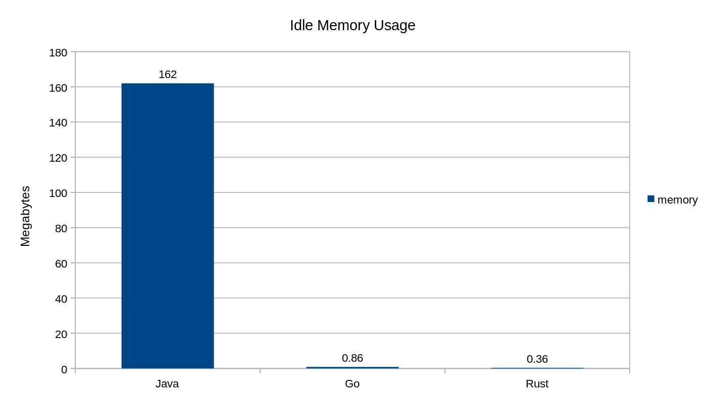

# Introduction

## why go?
- fast and lightweight (from C) => built from the frustration of c/c++
- easliy concurrent - support concurrency with goroutines
- easy and simple - low level language like C -> system programming language
- compiled language - faster than interpreted language and also faster than other compile language (except for rust, C)
- statically typed - enforces type checking at compile time, requiring variable types to be explicitly declared or inferred before the program runs. -> kinda ruined by the introduction of generics
- garbage collected - unlike C, memory management => gain a lot of critisism


### Generally speaking, there are two kinds of errors in programming:
- Compilation errors. Occur when code is compiled. It's generally better to have compilation errors because they'll never accidentally make it into production. You can't ship a program with a compiler error because the resulting executable won't even be created.
- Runtime errors. Occur when a program is running. These are generally worse because they can cause your program to crash or behave unexpectedly.


## Types Size

```
uint8       the set of all unsigned  8-bit integers (0 to 255)
uint16      the set of all unsigned 16-bit integers (0 to 65535)
uint32      the set of all unsigned 32-bit integers (0 to 4294967295)
uint64      the set of all unsigned 64-bit integers (0 to 18446744073709551615)

int8        the set of all signed  8-bit integers (-128 to 127)
int16       the set of all signed 16-bit integers (-32768 to 32767)
int32       the set of all signed 32-bit integers (-2147483648 to 2147483647)
int64       the set of all signed 64-bit integers (-9223372036854775808 to 9223372036854775807)

float32     the set of all IEEE 754 32-bit floating-point numbers
float64     the set of all IEEE 754 64-bit floating-point numbers

complex64   the set of all complex numbers with float32 real and imaginary parts
complex128  the set of all complex numbers with float64 real and imaginary parts

byte        alias for uint8
rune        alias for int32

```

The "default" int and uint types refer to their respective 32 or 64-bit sizes depending on the environment of the user. 

### Which type should I use?
When you're super concerned about performance and memory usage, you should go for specific type.


### Why is Go lightweight?
Each program includes a small amount of extra code that's included in the executable binary called the Go Runtime. One of the purposes of the Go runtime is to clean up unused memory at runtime. It includes a garbage collector that automatically frees up memory that's no longer in use.

> Go has an extensive runtime library, often just called the runtime, that is part of every Go program. This library implements garbage collection, concurrency, stack management, other features.



Java uses a virtual machine to interpret bytecode at runtime and typically allocates more on the heap. (WORA) 
> https://en.wikipedia.org/wiki/Write_once,_run_anywhere 


## Conditionals

An if conditional can have an "initial" statement. The variable(s) created in the initial statement are only defined within the scope of the if body.

```go
if INITIAL_STATEMENT; CONDITION {
}
```

For example, instead of writing:
```go
length := getLength(email)
if length < 1 {
    fmt.Println("Email is invalid")
}
```

We could write:
```go
if length := getLength(email); length < 1 {
    fmt.Println("Email is invalid")
}
```

It has two valuable purposes:
- It's a bit shorter
- It limits the scope of the initialized variable(s) to the if block


## Functions

Functions in Go can take zero or more arguments.

To make code easier to read, the variable type comes after the variable name.

```go
func sub(x int, y int) int {
  return x-y
}
```


### Go's Declaration Syntax

<later, have to read function pointer first>

```go
var f func(func(int,int) int, int) int
```

what is f ?

### Ignoring Return Values

A function can return a value that the caller doesn't care about. We can explicitly ignore variables by using an underscore, or more precisely, the blank identifier _.

```go
func getPoint() (x int, y int) {
  return 3, 4
}

// ignore y value
x, _ := getPoint()
```

### Named Return Values

```go
func getCoords() (x, y int){
  // x and y are initialized with zero values

  return // automatically returns x and y
}
```

is the same as:

```go
func getCoords() (int, int){
  var x int
  var y int
  return x, y
}
```

It's also supporting good documentation:
```go
func calculator(a, b int) (int, int, int, int) {
    mul := a * b 
    div := a / b
    add := a + b
    sub := a - b

    return mul, div, add, sub
}
```

```go
func calculator(a, b int) (mul int, div int, add int, sub int) {
    mul := a * b 
    div := a / b
    add := a + b
    sub := a - b

    return mul, div, add, sub
}
```

### Function as values

Go supports first-class and higher-order functions, which are just fancy ways of saying "functions as values". Functions are just another type -- like ints and strings and bools.


A programming language is said to have First-class functions when functions in that language are treated like any other variable. For example, in such a language, a function can be passed as an argument to other functions, can be returned by another function and can be assigned as a value to a variable.


### Defer
```go
package main

import "fmt"

func main() {

	for i := 0; i < 11; i++ {
		defer fmt.Println(i)
	}
}
```

> useful when connecting to database, there're a lot of cases where developers make connection to db but forgot to close it.  

### Scope

Unlike Python, Go is not function-scoped, it's **block-scoped**. Variables declared inside a block are only accessible within that block (and its nested blocks). There's also the package scope which can be think of global scope.


## Structs


 


